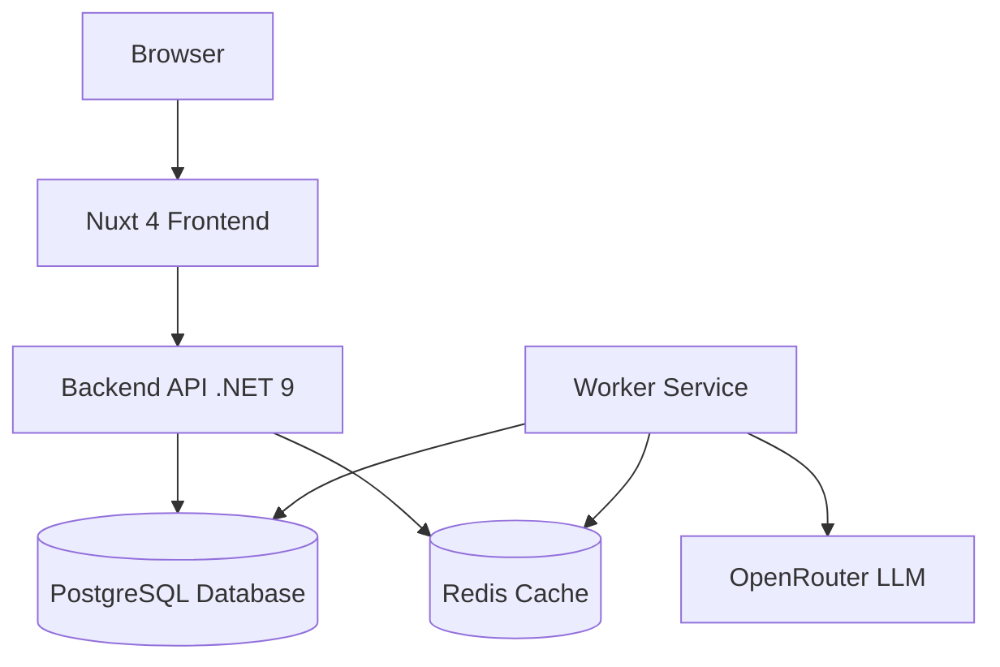

# Architecture

This document describes how Zeitung works and how its components interact.

## System Overview

Zeitung uses a modern architecture with separate services for different responsibilities:



## Components

### Frontend
Modern web interface built with Nuxt 4:
- Responsive design that works on all devices
- Fast page loads with server-side rendering
- Type-safe API integration

### Backend API
RESTful API built with .NET 9:
- Handles user authentication
- Manages feeds and articles
- Powers the recommendation engine
- Tracks user interactions

### Worker Service
Background service that:
- Fetches RSS feeds periodically
- Tags articles using AI (OpenRouter)
- Updates recommendations
- Maintains tag relationships

### Database
PostgreSQL stores:
- User accounts and preferences
- RSS feeds and articles
- Tags and relationships
- Interaction history

### Cache
Redis speeds up the app by caching:
- User sessions
- Frequently accessed data
- Recommendation scores

## How It Works

### Feed Ingestion
1. Worker fetches RSS feeds on schedule
2. Articles are parsed and stored
3. AI tags each article automatically
4. Tag relationships are calculated

### Personalized Recommendations
1. System tracks your interactions (clicks, likes)
2. Tag preferences are updated with decay
3. Articles are scored based on your interests
4. Feed recommendations are generated

### Authentication
1. Enter your email address
2. Receive a magic link via email
3. Click link to authenticate
4. No passwords needed

## Tag System

Zeitung uses AI to tag articles and learns your interests:

- **Explicit interests**: Tags you mark as interesting
- **Implicit signals**: Articles you click or like
- **Tag decay**: Old interests fade as new ones emerge
- **Smart recommendations**: Content matched to your preferences

## Running Zeitung

### With Docker
```bash
docker-compose up
```
Services start automatically with proper networking.

### For Development
Each service can run independently:
- Frontend: `npm run dev` (port 3000)
- Backend: `dotnet run` (port 8080)
- Worker: `dotnet run`

Services use .NET Aspire for orchestration and monitoring.
